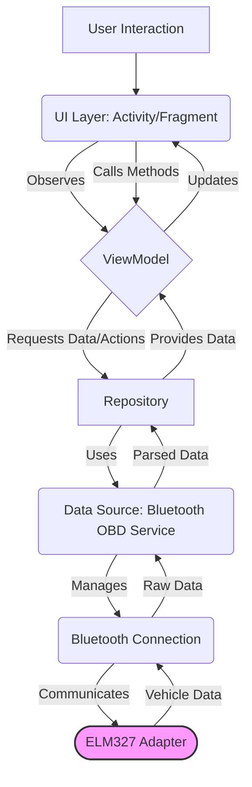

# OpenDrive System Architecture

## 1. Introduction

This document outlines the software architecture for the OpenDrive Android application. The primary goal is to create a robust, scalable, and maintainable system for real-time vehicle diagnostics using ELM327 OBD-II adapters. The architecture emphasizes modularity to facilitate future expansion and community contributions.

## 2. Core Principles

The architecture is guided by the following principles:

*   **Separation of Concerns:** Each component has a distinct responsibility, minimizing coupling.
*   **Testability:** Components are designed to be testable in isolation where possible.
*   **Reactivity:** The UI reacts to changes in data state seamlessly.
*   **Asynchronicity:** Blocking operations (especially Bluetooth I/O) are handled off the main thread.
*   **Modularity:** Core functionalities like OBD command handling are designed for easy extension.

## 3. High-Level Architecture Diagram

The application follows the **Model-View-ViewModel (MVVM)** pattern, enhanced with a Repository layer and a dedicated Service for Bluetooth communication.

## 4. Component Breakdown

### 4.1. UI Layer (View)

*   **Components:** Activities, Fragments, XML Layouts, Material Design Components.
*   **Responsibilities:**
    *   Displaying data provided by the ViewModel.
    *   Handling user input (button presses, selections).
    *   Requesting necessary permissions (Bluetooth).
    *   Observing ViewModel state (using LiveData or StateFlow) and updating the UI accordingly.
    *   Initiating actions by calling methods on the ViewModel.
*   **Notes:** Kept as "dumb" as possible, focusing solely on presentation logic. Future consideration for migration to Jetpack Compose for declarative UI.

### 4.2. ViewModel Layer

*   **Components:** Classes extending `androidx.lifecycle.ViewModel`.
*   **Responsibilities:**
    *   Holding UI-related state (e.g., connection status, latest RPM, speed).
    *   Exposing state to the UI via observable holders (LiveData/StateFlow).
    *   Containing presentation logic and handling UI events forwarded from the View.
    *   Interacting with the Repository to fetch data or trigger actions (e.g., connect, request specific PIDs).
    *   Scoped to the lifecycle of the UI component (Activity/Fragment), ensuring state persistence across configuration changes.
*   **Notes:** Acts as the bridge between the UI and the data/business logic layers. Uses Kotlin Coroutines for managing asynchronous operations initiated from the UI.

### 4.3. Repository Layer

*   **Components:** Singleton or dependency-injected Repository class(es).
*   **Responsibilities:**
    *   Acting as the single source of truth for application data.
    *   Abstracting the data sources from the ViewModel. The ViewModel requests data from the Repository without needing to know *how* or *where* it comes from (Bluetooth, cache, etc.).
    *   Mediating between different data sources (currently primarily the Bluetooth Service).
    *   Potentially handling data caching strategies in the future.
    *   Transforming raw data from sources into formats suitable for the ViewModel.
*   **Notes:** Provides a clean API for data access to the rest of the application.

### 4.4. Data Source Layer (Bluetooth OBD Service)

*   **Components:** A dedicated Service or Manager class handling Bluetooth communication.
*   **Responsibilities:**
    *   Managing the Bluetooth connection lifecycle: scanning, pairing (delegated to OS), connecting, disconnecting.
    *   Handling low-level Bluetooth socket communication (InputStream/OutputStream).
    *   Sending formatted OBD-II commands (AT commands, PID requests) to the ELM327 adapter.
    *   Receiving raw ASCII responses from the adapter.
    *   Performing initial parsing or validation of responses before passing them up to the Repository.
    *   Running communication tasks on background threads (using Coroutine Dispatchers.IO).
*   **Notes:** Isolates all Bluetooth-specific logic. This component interacts directly with the hardware abstraction (the ELM327).

### 4.5. OBD Communication Module

*   **Components:** Data classes/interfaces for `ObdCommand`, specific command implementations (e.g., `RpmCommand`, `SpeedCommand`), `ObdResponseParser`.
*   **Responsibilities:**
    *   Defining the structure of an OBD command (command string, expected response format, parsing logic).
    *   Encapsulating the logic for parsing specific PID responses (converting hex bytes to meaningful values).
    *   Providing an extensible mechanism to add support for new PIDs easily.
*   **Notes:** This module promotes the "Modular Architecture" goal, allowing developers to contribute support for new PIDs without modifying the core Bluetooth service significantly.

## 5. Data Flow Example (Requesting RPM)

1.  **User Action:** User ensures the app is connected.
2.  **UI Layer:** (Implicitly or explicitly triggered) UI observes the RPM LiveData/StateFlow.
3.  **ViewModel:** Periodically (or on demand) calls `repository.getEngineRpm()`.
4.  **Repository:** Calls `bluetoothObdService.executeCommand(RpmCommand)`.
5.  **Bluetooth Service:**
    *   Ensures Bluetooth connection is active.
    *   Retrieves the command string from `RpmCommand` (e.g., "010C").
    *   Sends the command string via Bluetooth OutputStream.
    *   Reads the response (e.g., "41 0C 0A 3B >") from InputStream on a background thread.
    *   Passes the raw response back to the Repository (or performs basic parsing).
6.  **Repository:**
    *   Receives the raw response.
    *   Uses the parsing logic associated with `RpmCommand` to extract `0A 3B`.
    *   Applies the formula `((0x0A * 256) + 0x3B) / 4` to get the RPM value.
    *   Updates its internal state/cache.
7.  **ViewModel:** The LiveData/StateFlow observed by the UI is updated with the new RPM value via the Repository.
8.  **UI Layer:** Automatically redraws the RPM TextView with the updated value.

## 6. Threading Model

*   **Main Thread:** UI interactions, observing ViewModel state.
*   **Background Threads (Coroutine Dispatchers.IO):** All Bluetooth socket I/O operations, potentially complex data parsing/processing.
*   **ViewModelScope:** Used within ViewModels to launch coroutines tied to the ViewModel's lifecycle.

## 7. Modularity & Extensibility

The architecture is designed for extensibility:

*   **PID Support:** Adding new PIDs involves creating a new `ObdCommand` implementation with its specific command string and parsing logic. The Repository and Service can dynamically handle registered commands.
*   **Data Sources:** While currently focused on Bluetooth, the Repository pattern allows adding other data sources (e.g., file logging/playback, alternative hardware interfaces) with minimal impact on the ViewModels.
*   **UI:** Separation allows UI layer changes (e.g., XML to Compose) without rewriting core logic.

## 8. Future Considerations

*   Robust error handling and reporting (Bluetooth disconnects, invalid OBD responses, timeouts).
*   Implementation of data logging features.
*   Advanced caching strategies in the Repository.
*   UI refinements and potentially Jetpack Compose migration.
*   Implementation of Diagnostic Trouble Code (DTC) reading/clearing logic (Mode 03, 04, 07, 0A).